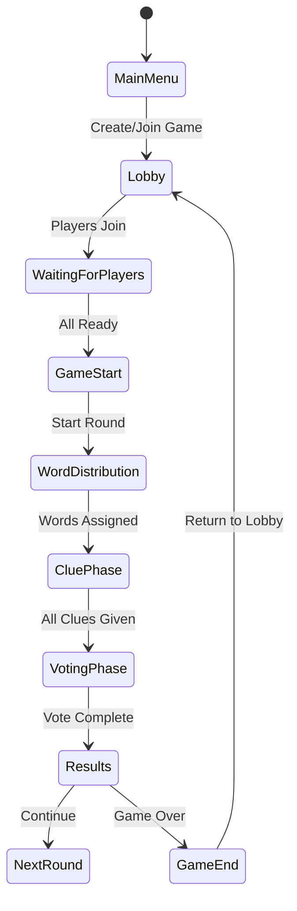

# The Impostor - Steam Game

A multiplayer social deduction word game for Steam, built with Unity. Players must identify the "Impostor" in their group based on word clues.

## Implementation Plan

### Architecture Overview

The game is built in Unity (C#) with Steamworks SDK integration. The core architecture follows a host-client model where one player acts as the host, managing game state and synchronizing with other players via Steam P2P networking.

**Key Components:**

1. **Steam Integration Layer** - Steamworks SDK wrapper for authentication, networking, and Steam features
2. **Networking System** - P2P communication using Steam Networking API
3. **Game State Manager** - Centralized game logic and state synchronization
4. **3D Table Scene** - Immersive POV view with stylized table and player positions
5. **UI System** - Menus, lobby, in-game HUD, voting interface
6. **Word Database** - Curated word list system
7. **Player Management** - Player roles, avatars, and session handling

### Core Game Flow



### Implementation Phases

**Phase 1: Project Setup & Steam Integration** ✅
- Unity project structure, Steamworks SDK integration, SteamManager, lobby system

**Phase 2: Networking Foundation** ✅
- NetworkMessage serialization, NetworkManager, P2P connections, host migration

**Phase 3: Core Game Logic** ✅
- GameManager state machine, PlayerManager, WordManager, RoundManager, VoteManager

**Phase 4: 3D Table Scene** ✅
- Table environment, player positions, TableCameraController, POV view

**Phase 5: UI Systems** ✅
- MainMenuUI, LobbyUI, GameUI, VoteUI with Steam integration

**Phase 6: Word System & Game Balance** ✅
- Word database, selection algorithm, categories/themes

**Phase 7: Polish & Steam Features** ✅
- Steam achievements, rich presence, audio system, visual polish

**Phase 8: Testing & Optimization**
- Multiplayer testing, network optimization, performance tuning

### Technical Considerations

- **Steam Networking**: Steam Networking Sockets for reliable P2P, message queuing, graceful disconnection handling
- **Game State**: Host maintains authoritative state, clients send actions, deterministic updates
- **Word Distribution**: Host selects and securely distributes words, prevents cheating
- **Performance**: Optimized 3D scene, object pooling, LOD implementation

## Quick Start

### Requirements

- Unity 2021.3 LTS or newer
- **Steamworks.NET package** (REQUIRED - download from [GitHub](https://github.com/rlabrecque/Steamworks.NET/releases))
- Steam installed and running (for testing)
- TextMeshPro (included with Unity)

### Getting Started

1. **Open Project in Unity**
   - Open Unity Hub → Add project → Select Impostor folder
   - Wait for Unity to import assets

2. **Import Steamworks.NET** (REQUIRED)
   - Download from: https://github.com/rlabrecque/Steamworks.NET/releases
   - In Unity: `Assets > Import Package > Custom Package`
   - Select the downloaded `.unitypackage`
   - Import all files
   - **This fixes all compilation errors**

3. **Install TextMeshPro**
   - Window > TextMeshPro > Import TMP Essential Resources

4. **Set Up Steam for Testing**
   - Create `steam_appid.txt` in project root (same level as `Assets` folder)
   - Add the number `480` to the file (Spacewar test app ID)
   - **Important:** Steam must be running before testing!

5. **Create Scenes** (see [QUICK_START.md](QUICK_START.md))
   - MainMenu, Lobby, GameTable scenes
   - Add Canvas and UI elements
   - Attach UI scripts and assign references

6. **Add Manager GameObjects**
   - Create empty GameObjects in MainMenu scene
   - Add components: SteamManager, SteamLobbyManager, NetworkManager, GameManager, WordManager

7. **Press Play!**
   - Ensure Steam is running
   - Check Console for "Steam initialized successfully"

**📖 For detailed setup instructions, see [QUICK_START.md](QUICK_START.md)**  
**📖 For Steam-specific setup, see [STEAM_SETUP.md](STEAM_SETUP.md)**

## Project Structure

```
Assets/
├── Scripts/
│   ├── Steam/          # Steam integration
│   ├── Game/           # Core game logic
│   ├── Networking/     # Network message handling
│   ├── UI/             # UI controllers
│   ├── Camera/         # Camera controller
│   └── Audio/          # Audio management
├── Scenes/             # MainMenu, Lobby, GameTable
├── Prefabs/            # PlayerAvatar, LobbyPlayerSlot, VoteButton, ClueItem
├── Resources/Words/    # wordlist.txt (150+ words)
└── Models/             # 3D models and assets
```

## Game Flow

1. **Main Menu** → Create or join lobby
2. **Lobby** → Wait for players, set ready status
3. **Game** → Secret word assigned (Civilians see word, Impostor sees "IMPOSTOR")
4. **Clue Phase** → Players take turns giving one-word clues
5. **Voting** → Vote to identify the Impostor
6. **Results** → Next round or game end

## Implementation Status

✅ Steam Integration | ✅ Networking System | ✅ Core Game Logic | ✅ UI Systems | ✅ Camera System | ✅ Audio System | ✅ Word Database

## Troubleshooting

- **Steam Not Initializing**: Ensure Steam is running, check `steam_appid.txt`, verify SDK files in `Assets/Plugins/`
- **Network Issues**: Check firewall, enable Steam Networking, verify same network for local testing
- **UI Not Showing**: Set Canvas to Screen Space - Overlay, verify scripts attached, import TextMeshPro
- **Missing References**: Assign prefabs in Inspector, verify GameObjects exist, check tags

## Resources

- [Steamworks Documentation](https://partner.steamgames.com/doc/home)
- [Unity Networking Guide](https://docs.unity3d.com/Manual/UnityNetworking.html)
- [TextMeshPro Documentation](https://docs.unity3d.com/Packages/com.unity.textmeshpro@latest)
